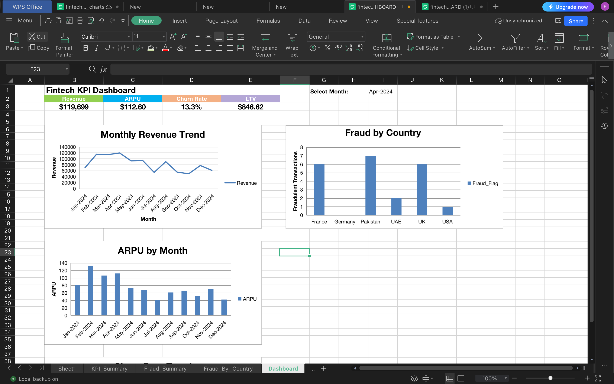

# 📊 Fintech KPI Dashboard

This project is an **interactive Fintech KPI Dashboard** built with Excel (and WPS/Office).  
It highlights key metrics like **Revenue, ARPU, Churn, LTV**, and fraud detection by country.
---

## 🌟 Project Highlights

- Automated **Fintech KPI Dashboards** (Excel + Slicers + Charts).
- End-to-end **data pipeline**: SQL → Python → Excel.
- KPIs covered: **CAC, LTV, ARPU, Churn, Revenue**.
- **Fraud detection** by country using SQL + Python.
- 📊 Professional visualizations with executive-ready layout.
- 🔗 Downloadable dashboards + GitHub-hosted screenshots.

---

---

## 🚀 Features
- KPI cards with slicer-based interactivity
- Monthly Revenue and ARPU trends
- Fraud analysis by country
- Clean executive dashboard layout

---

  
  
  
  

# 📊 Fintech KPI Dashboard

This project is an **interactive Fintech KPI Dashboard** built with Excel (and WPS/Office).
It highlights key metrics like **Revenue, ARPU, Churn, LTV**, and fraud detection by country.

---

## ✨ Features
- KPI cards with slicer-based interactivity  
- Monthly Revenue and ARPU trends  
- Fraud analysis by country  
- Clean executive dashboard layout  

---

## 🖼️ Dashboard Screenshots

### Full Dashboard

### KPI Cards

### Fraud by Country

---

## 📂 Download the Dashboard Files

You can download and explore the Excel dashboards here:

# 📊 Fintech KPI Dashboard  

  
  
  
  

